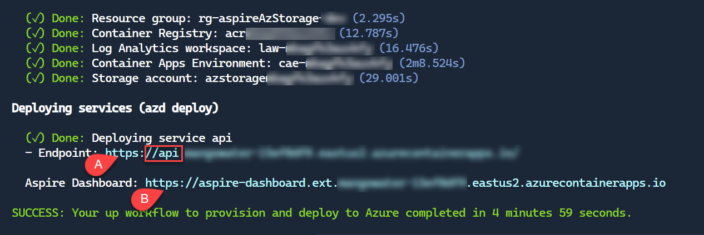

# Aspire Azure Storage Demo

This project demonstrates how to use Azure Table Storage with a Minimal API and .NET Aspire - a cloud-ready stack for building observable, production-ready, distributed applications.

## Overview

AspireAzStorage is a sample application that shows how to:

- Use .NET Aspire to build cloud-native applications
- Integrate Azure Table Storage in an Aspire application
- Implement a Minimal API
- Utilize the Azure Storage Emulator for local development
- Add observability with OpenTelemetry

The application manages employee data through various endpoints that allow you to:
- Generate sample employee data
- Query employees by various criteria
- Group employees by country or first letter of name

## Prerequisites

- [.NET 9+ SDK](https://dotnet.microsoft.com/download/dotnet/9.0)
- [Docker Desktop](https://www.docker.com/products/docker-desktop/) or [Podman](https://podman.io/getting-started/installation) (for local development)

- [Azure Developer CLI](https://learn.microsoft.com/en-us/azure/developer/azure-developer-cli/install-azd) (for deployment)

## Running Locally

### 1. Get the repository

```bash
azd init -t FBoucher/AspireAzStorage
```

**or** if you prefer, you can clone it with the folling command:

```bash
git clone https://github.com/yourusername/AspireAzStorage.git
cd AspireAzStorage
```

### 2. To Run the Application Locally

Make sure Docker or Podman are running. From your code editor start the project in the `AspireAzStorage.AppHost` folder, or use "F5". You can also use the command line to run the application:

```bash
dotnet run --project AspireAzStorage.AppHost
```

This will start:

- The .NET Aspire dashboard
- The API application
- Azure Storage Emulator
  
The Aspire dashboard will open automatically, showing you all the components and their status.

### 3. Test the API

Use the included [Api.http](./Api/Api.http) file to test the API endpoints, or send requests to the following endpoints:

- Generate sample data: GET https://localhost:7125/api/generate/10 (mandatory to generate data before querying)
- Get all employees: GET https://localhost:7125/api/GetEmployeesAsync
- Get employees by country: GET https://localhost:7125/api/GetEmployeeByCountryAsync
- Get employees by last name's first letter: GET https://localhost:7125/api/employees/B
- Get employees grouped by first letter of first name: GET https://localhost:7125/api/employeesGroupByFirstLetterFirstNameAsync

## Deploying to Azure

1. If you haven't already, log in to your Azure account with `azd auth login`.

1. Provision all required Azure resources and deploy the application with the following command:

	```bash
	azd up
	```

1. Get the application URL

After the deployment is complete, you will see the URL of your application (A) in the terminal; the one starting by `https://api.`. There is also many details about the resources created in Azure, and a link to the .NET Aspire dashboard (B).



## Community & Support
Have questions or found an issue? We'd love to hear from you!

Issues: Please report bugs or feature requests through the [Issues](https://github.com/FBoucher/AspireAzStorage/issues) page.
Contributions: Pull requests are welcome! Please feel free to contribute to this project.

## License
This project is licensed under the MIT License - see the [LICENSE](./LICENSE) file for details.
